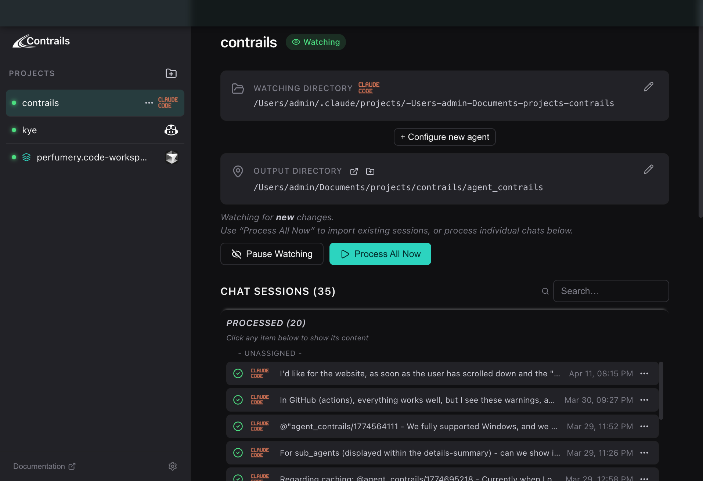

# Contrails ✈️

[](https://github.com/ThreePalmTrees/Contrails/releases/latest)
[](https://github.com/ThreePalmTrees/Contrails/releases/latest)
[](https://github.com/ThreePalmTrees/Contrails/releases/latest)
[](LICENSE)
[](https://github.com/ThreePalmTrees/Contrails/releases/latest)

<p align="center">
  
</p>

**Preserve your coding agent trails.**

<i>Contrails, short for "condensation trails", are the trails left behind by aircrafts at high altitudes.</i>

Contrails is an opensource app (macOS, Windows and Linux) that:
1. Watches your coding agent sessions _(VS Code Copilot, Claude Code, and Cursor)_
2. Parses them into readable Markdown
3. Saves them into your project repositories.

This way you keep the reasoning that led to fixing a bug or implementing a feature.



Built with [Wails v2](https://wails.io/) (Go + React + TypeScript).

## Why

Coding agents forget everything between sessions. The reasoning that led to a fix, the wrong approaches that were tried, the self-corrections — all of it vanishes.
<br/>
Contrails watches agent session files in real-time and outputs clean, human-readable Markdown into a `contrails/` directory in your project, making your agent conversations part of your repo history.

When working on a related feature in the future, you can reference relevant contrails to help the agent remember its previous reasoning.

## Supported Agents

| Agent | Discovery | Watching | Format |
|-------|-----------|----------|--------|
| **VS Code Copilot** | Scans `workspaceStorage/` for workspaces with `chatSessions/` | `fsnotify` on `chatSessions/` directory | JSONL event log (v3) |
| **Claude Code** | Scans `~/.claude/projects/` for session files | Signal watcher on `~/contrails/hook-signals/` via Stop hook | JSONL transcript |
| **Cursor** | Scans `workspaceStorage/` for per-workspace `state.vscdb` files | `fsnotify` on per-workspace storage + global `globalStorage/` directory (debounced 2 s) | SQLite — per-workspace `ItemTable` for composer list + global `cursorDiskKV` for `composerData:*` + `bubbleId:*` keys |

## Installation

### Windows

1. Download `Contrails-windows.zip` from the [latest release](https://github.com/ThreePalmTrees/Contrails/releases/latest)
2. Unzip the archive
3. Run `contrails.exe`

### macOS

1. Download `Contrails-macos.zip` from the [latest release](https://github.com/ThreePalmTrees/Contrails/releases/latest)
2. Unzip and drag `contrails.app` to your Applications folder
3. Remove the macOS quarantine flag:
   ```bash
   xattr -cr /Applications/contrails.app
   ```
4. Launch Contrails normally

> **Why is step 3 needed?** macOS requires apps to be notarized. Notarization costs $99/year — Apple effectively charges indie developers a yearly toll just to let users open their software. Until we bite that bullet, `xattr -cr` is the workaround.

### Linux

1. Download `Contrails-linux.zip` from the [latest release](https://github.com/ThreePalmTrees/Contrails/releases/latest)
2. Unzip the archive
3. Make the binary executable and run it:
   ```bash
   chmod +x contrails
   ./contrails
   ```

> **Dependencies:** Linux requires WebKit2GTK and GTK3 runtime libraries. On Ubuntu/Debian: `sudo apt install libgtk-3-0 libwebkit2gtk-4.1-0`. On Fedora: `sudo dnf install gtk3 webkit2gtk4.1`. Most desktop Linux distributions have these pre-installed.

## Features

- **Auto-discovery** - Finds projects with agent chat sessions automatically. VS Code and Cursor workspaces are resolved via `workspace.json`; Claude Code projects are discovered from `~/.claude/projects/`
- **Filesystem watching** - Uses `fsnotify` to detect new or modified VS Code chat sessions instantly
- **Signal-based capture** - Claude Code sessions are captured via a Stop hook that writes signal files when a session ends
- **Deleted session handling** - When a chat session file is deleted, the corresponding Markdown is flagged with a deletion banner rather than removed
- **Smart parsing** - Preserves the order of text, thinking blocks, tool calls, and file edits exactly as they occurred during the conversation
- **Multi-agent projects** - A single project can have VS Code Copilot, Claude Code, and Cursor sources simultaneously
- **Markdown output** - Generates clean `.md` files
- **Project management** - Track multiple workspaces, rename them, pause/resume watching
- **Persistent state** - Projects list persists across restarts; selected project stored in localStorage
- **Anonymous telemetry** - Optional, anonymous usage telemetry via PostHog (Go SDK). Tracks aggregate metrics like app starts, project counts, and contrails created. No personal data is collected. A persistent device UUID is generated on first launch — no accounts or sign-in required. Telemetry can be toggled on/off from the sidebar footer; the preference is persisted across restarts. Disabled entirely in dev builds (no API key injected)
- **Auto-update** - On launch, checks GitHub Releases for a newer version. If available, shows a one-click update button.

## Architecture

```
contrails/
├── main.go              # Wails app entry, macOS window config, build-time Version + PostHogAPIKey
├── app.go               # Composition root: project CRUD, driver registry, processing dispatch
├── analytics.go         # PostHog client wrapper — fail-safe, opt-out, device ID, event tracking
├── updater.go           # GitHub Releases update checker + atomic .app bundle replacement
├── runtime.go           # Interfaces (EventEmitter, DialogOpener) + Wails implementations
├── types.go             # Project, AgentSource, event structs + type aliases to agent pkg
├── watcher.go           # fsnotify-based VS Code directory watcher
├── agent/
│   ├── driver.go            # AgentDriver interface + ProcessCallbacks
│   ├── contrail.go          # ParsedSession, ParsedMessage, MessagePart types + SessionParser interface
│   ├── writer.go            # WriteParsedSession — markdown rendering
│   ├── logger.go            # Logger interface + LogInfof/LogWarningf/LogErrorf helpers
│   ├── format.go            # FormatTimestamp, SanitizeFilename utilities
│   ├── claudecode/
│   │   ├── driver.go        # AgentDriver impl — hook lifecycle + signal watcher + ProcessAll
│   │   ├── parser.go        # Claude Code JSONL transcript → ParsedSession
│   │   ├── scanner.go       # Browse ~/.claude/projects/ for sessions
│   │   ├── hook.go          # Install/uninstall Stop hook in .claude/settings.local.json
│   │   ├── hook_enforcer.go # Periodic enforcement — ensures Stop hook stays installed
│   │   ├── signal_watcher.go # Watch ~/contrails/hook-signals/ via SignalHandler interface
│   │   └── types.go         # Claude Code raw types (SignalFile, contentBlock, etc.)
│   ├── vscode/
│   │   ├── driver.go        # AgentDriver impl — fsnotify lifecycle + ProcessAll + HealContrailNames
│   │   ├── parser.go        # VS Code JSONL event log → ParsedSession (materialize + walk)
│   │   └── types.go         # VS Code raw types (chatSession, jsonlEvent, etc.)
│   └── cursor/
│       ├── driver.go        # AgentDriver impl — fsnotify on workspaceStorage (debounced), ProcessAll
│       ├── parser.go        # Cursor SQLite cursorDiskKV → ParsedSession (composerData + bubbleId keys)
│       ├── scanner.go       # Scan workspaceStorage for per-workspace state.vscdb files
│       └── types.go         # Cursor raw types (composerData, bubble, capabilityType, etc.)
└── frontend/
    └── src/
        ├── App.tsx              # Root component: sidebar + main layout
        ├── App.css              # All component styles
        ├── style.css            # CSS reset, variables, base styles
        ├── types.ts             # TypeScript interfaces
        ├── hooks/
        │   └── useProjects.ts   # State management, watcher event listener
        └── components/
            ├── ProjectList.tsx       # Sidebar project list with context menus
            ├── ProjectDetail.tsx     # Selected project detail view
            ├── AddProjectDialog.tsx  # Workspace browser + project config dialog
            ├── OnboardingTour.tsx    # First-run guided tour
            └── ContrailsIcon.tsx     # App icon component
```

### Backend (Go)

| File | Responsibility |
|------|---------------|
| `app.go` | Composition root — project CRUD (persisted to platform config dir + `contrails/projects.json`), driver registry + dispatch, native directory pickers, workspace scanning, incremental processing, telemetry settings, update check. Implements `claudecode.SignalHandler` to receive signal events via dependency inversion. |
| `analytics.go` | PostHog client wrapper — fail-safe design (all methods silently no-op on failure), device ID generation/persistence (`~/.config/contrails/device_id`), opt-out support, event tracking (app lifecycle, project/source/contrail events). Disabled entirely when API key is empty (dev builds). |
| `updater.go` | GitHub Releases update checker — polls `ThreePalmTrees/Contrails` releases, semantic version comparison, downloads and atomically replaces the full `.app` bundle, relaunches via `open`. Skipped for `dev` builds. |
| `runtime.go` | Testability interfaces (`Logger`, `EventEmitter`, `DialogOpener`) with production (Wails-backed) and test (Noop, Recording) implementations. `Logger` is a type alias for `agent.Logger`. |
| `watcher.go` | Wraps `fsnotify` to watch VS Code `chatSessions/` directories for `.jsonl` files, emits events to frontend via Wails runtime |
| `types.go` | Project, AgentSource, event structs (WatcherEvent, FileProcessedEvent). Parsed session types are aliases to `agent.ParsedSession` etc. |
| `agent/driver.go` | `AgentDriver` interface (Setup, Teardown, Activate, Deactivate, ProcessAll) + `ProcessCallbacks` struct |
| `agent/contrail.go` | `SessionParser` interface, `ParsedSession`, `ParsedMessage`, `MessagePart` types and constants |
| `agent/writer.go` | `WriteParsedSession` — renders a `ParsedSession` as clean Markdown and writes to disk |
| `agent/logger.go` | `Logger` interface + `LogInfof`/`LogWarningf`/`LogErrorf` helpers |
| `agent/format.go` | `FormatTimestamp`, `FormatISO8601Timestamp`, `SanitizeFilename` — pure utility functions |
| `agent/vscode/` | VS Code Copilot `AgentDriver` — manages fsnotify watching, batch processing with `HealContrailNames`, JSONL parser that materializes the event log (kind:0/1/2 patches with array splice semantics) and uses `toolCallRounds` as the authoritative text source |
| `agent/claudecode/` | Claude Code `AgentDriver` — manages hook lifecycle and signal watching, JSONL transcript parser, project scanner (`~/.claude/projects/`), Stop hook installer, periodic hook enforcer |
| `agent/cursor/` | Cursor `AgentDriver` — watches per-workspace + global `state.vscdb` via fsnotify (2 s debounce), SQLite parser that reads composer list from per-workspace `ItemTable` and conversation data (`composerData:*` + `bubbleId:*` keys) from global `cursorDiskKV`, workspace scanner |

### Frontend (React + TypeScript)

| File | Responsibility |
|------|---------------|
| `useProjects.ts` | Centralized state hook — loads projects, listens for watcher events, auto-processes on file changes, persists selection to localStorage |
| `ProjectList.tsx` | Sidebar list with inline rename, status dots (green = watching), context menu (rename, pause, process, remove) |
| `AddProjectDialog.tsx` | Agent-aware project setup — browse auto-detected VS Code, Claude Code, and Cursor workspaces, configure name + output dir |
| `ProjectDetail.tsx` | Shows watch/output paths, status badge, manual process button |

## How It Works

### VS Code Copilot

1. **Add a project** — The app scans the VS Code workspace storage directory for directories containing a `chatSessions/` subfolder (`~/Library/Application Support/Code/User/workspaceStorage/` on macOS, `%APPDATA%/Code/User/workspaceStorage/` on Windows, `~/.config/Code/User/workspaceStorage/` on Linux). It reads `workspace.json` to resolve the project name.

2. **Watch** — `fsnotify` monitors the `chatSessions/` directory. Any `.jsonl` file create or modify triggers incremental processing — only files modified after the project's `lastProcessedAt` timestamp are processed. When a project is first added, `lastProcessedAt` is set to the current time so existing files aren't auto-processed; use "Process All Now" for the initial backlog. When a `.jsonl` file is deleted, the corresponding Markdown file is flagged with a deletion banner.

3. **Parse** — Each `{uuid}.jsonl` is a v3 event log. The parser materializes the final session state by replaying events:
   - `kind:0` — initial state snapshot
   - `kind:1` — scalar patch at a key path (e.g., `["customTitle"]`)
   - `kind:2` — array patch at a key path with optional splice index `i` (e.g., `["requests", 0, "response"]`)

   Once materialized, the parser uses a dual strategy. When `result.metadata.toolCallRounds` is available (completed requests), it serves as the authoritative text source — the streaming protocol can lose text fragments during splice operations, but `toolCallRounds` preserves the complete narrative. Tool call details, file edits, and thinking blocks are still extracted from the deduplicated `response[]`, correlated to `toolCallRounds` entries by position. For in-progress requests without `toolCallRounds`, the parser falls back to walking the deduplicated `response[]` directly.

4. **Output** — A Markdown file is written to the output directory (default: `{project}/contrails/`). The filename uses the session's `customTitle` when available, falling back to `{sessionId}.md` for untitled sessions. When a title changes, the old file is automatically cleaned up.

5. **Healing** — At app startup and during "Process All Now", contrails scans for `.md` files that still use a session ID as their filename. If the source JSONL now has a `customTitle`, the file is re-processed and renamed automatically.

### Claude Code

1. **Add a project** — The app scans `~/.claude/projects/` for directories containing `.jsonl` session files. Projects are also discoverable by browsing to any directory on disk.

2. **Hook install and enforcement** — When a Claude Code source is added, Contrails installs a Stop hook into `{project}/.claude/settings.local.json`. The hook writes the session metadata (cwd, transcript path, session ID) to a signal file in `~/contrails/hook-signals/` when a session ends. A `HookEnforcer` runs every 5 seconds while the app is open, verifying the hook is still present and re-installing it if the file was deleted or the hook entry was removed. Hooks are not removed on app close — only when the Claude Code source is explicitly removed from a project.

3. **Signal watch** — The `SignalWatcher` monitors `~/contrails/hook-signals/` via `fsnotify`. When a signal file appears, it matches the `cwd` to a registered project via the `SignalHandler` interface (implemented by `App`), parses the Claude Code transcript, and writes the contrail.

4. **Parse** — Claude Code transcripts are JSONL files where each line is a message with `role` (human/assistant) and `content` blocks (text, tool_use, tool_result, thinking). The parser extracts the full conversation including tool calls, reasoning, and file edits.

5. **Output** — Same Markdown format and output directory as VS Code. Title is derived from the first user message if not available.

### Cursor

1. **Add a project** — The app scans the Cursor workspace storage directory for per-workspace `state.vscdb` files (`~/Library/Application Support/Cursor/User/workspaceStorage/` on macOS, `%APPDATA%/Cursor/User/workspaceStorage/` on Windows, `~/.config/Cursor/User/workspaceStorage/` on Linux) and resolves the workspace path via `workspace.json`.

2. **Watch** — `fsnotify` monitors both the per-workspace storage directory and the global `globalStorage/` directory for writes to `state.vscdb` or its WAL companion. The global database is always watched because bubble (message) content is written there on every Cursor interaction, regardless of workspace. Cursor writes in rapid bursts, so notifications are debounced by 2 seconds before processing.

3. **Parse** — Cursor uses two SQLite databases. The per-workspace `state.vscdb` stores the composer list in an `ItemTable` under key `composer.composerData`. The global `state.vscdb` (in `globalStorage/` under the Cursor config directory) stores conversation data in a `cursorDiskKV` table. Each composer session has a `composerData:<id>` key with metadata and a `fullConversationHeadersOnly` array that provides the authoritative message order. Individual messages are stored as `bubbleId:<composerId>:<bubbleId>` keys. The parser reads bubbles in header order: `type=1` → user message, `type=2` → AI message. Rich content (tool calls, thinking blocks, code) is decoded from typed capability fields (`capabilityType` 15 = tool call, 30 = thinking block).

4. **Output** — Same Markdown format and output directory as VS Code and Claude Code. Title is taken from the composer's `name` field when available.

## Development Prerequisites

- **Go** ≥ 1.23
- **Node.js** ≥ 18
- **Wails CLI** - `go install github.com/wailsapp/wails/v2/cmd/wails@latest`
- **Lefthook** - `go install github.com/evilmartians/lefthook@latest`

## Development

```bash
# Install frontend dependencies
cd frontend && yarn --ignore-scripts && cd ..

# Install git hooks
lefthook install

# Run in development mode (hot reload)
wails dev
```

## Testing

```bash
# Run all tests
go test ./... -v
```

Tests use `t.TempDir()` for filesystem isolation and interface injection (defined in `runtime.go`) to decouple from the Wails runtime. JSONL fixture files live in `testdata/fixtures/`, organized by agent type (`vscode/`, `claudecode/`). Cursor tests use in-memory SQLite databases instead of fixture files.

## Building

```bash
# Build universal macOS app (dev — no telemetry, no update checks)
./buildMacOS.sh

# Build Windows executable
./buildWindows.sh

# Build Linux binary (requires libgtk-3-dev and libwebkit2gtk-4.1-dev)
./buildLinux.sh

# Build with version + telemetry (used by CI/CD)
./buildMacOS.sh 1.2.3 phc_xxxx
./buildWindows.sh 1.2.3 phc_xxxx
./buildLinux.sh 1.2.3 phc_xxxx

# Outputs:
# macOS:   build/bin/contrails.app
# Windows: build/bin/contrails.exe
# Linux:   build/bin/contrails
```

Each build script wraps `wails build` with the appropriate platform flag, injects `Version` and `PostHogAPIKey` via `-ldflags` when provided. `buildLinux.sh` additionally passes `-tags webkit2_41` for Ubuntu 24.04+ compatibility. When `Version` is `"dev"` (no arguments), update checks and telemetry are disabled.

## Releasing

```bash
# Tag and push a new minor release (default)
./release.sh

# Or specify the bump type
./release.sh patch   # v0.1.0 → v0.1.1
./release.sh minor   # v0.1.0 → v0.2.0
./release.sh major   # v0.1.0 → v1.0.0
```

`release.sh` reads the latest semver git tag, increments it, tags, and pushes to origin. The push triggers the GitHub Actions workflow (`.github/workflows/release.yml`) which builds for all three platforms (macOS, Windows, Linux) in parallel and creates a GitHub Release with all artifacts attached. The PostHog API key is injected from a repository secret.

## Configuration

Projects are stored in the platform config directory:
```
macOS:   ~/Library/Application Support/contrails/projects.json
Windows: %APPDATA%/contrails/projects.json
Linux:   ~/.config/contrails/projects.json
```

Telemetry preference and device identity:
```
~/.config/contrails/settings.json   # { "analyticsEnabled": true }
~/.config/contrails/device_id       # persistent UUID (generated on first launch)
```

Default output directory per project:
```
{workspace_path}/contrails/
```

It's suggested to commit `contrails/`.

## Contributing

Contributions are welcome! Here's how to get started:

1. Fork the repository
2. Install prerequisites (see [Development Prerequisites](#development-prerequisites))
3. Install git hooks: `lefthook install`
4. Create a feature branch from `main`
5. Make your changes
6. Commit your changes — pre-commit hooks will automatically run `yarn build`, `go vet`, and `go test`
7. Include a contrail of the agent session that produced the work (the `contrails/` directory in your project)
8. Open a pull request against `main`

## Reporting Issues

Found a bug? Please [open an issue](https://github.com/ThreePalmTrees/Contrails/issues/new) with the following details:

- **Agent:** Which coding agent is affected (VS Code Copilot, Claude Code, Cursor)
- **Contrails version:** Shown in the About dialog (`Contrails` → `About Contrails`)
- **Steps to reproduce:** A clear, numbered list of actions that trigger the issue
- **Expected behavior:** What you expected to happen
- **Actual behavior:** What actually happened
- **Screenshots or screen recordings:** If applicable, attach visuals to help illustrate the problem

## Telemetry

Contrails collects anonymous telemetry via [PostHog](https://posthog.com/) to understand how the app is used (e.g., number of active users, contrails created, agents used). No personal data, file contents, or conversation text is collected.

- **Opt-out:** Click the "Telemetry on/off" toggle in the sidebar footer. The preference is saved immediately and persists across restarts.
- **Device identity:** A random UUID is generated on first launch and stored locally. There are no user accounts.
- **Fail-safe:** Telemetry never blocks the app. If PostHog is unreachable or returns an error, events are silently dropped.
- **Dev builds:** Telemetry is completely disabled when no API key is injected (local `wails dev` / `wails build` without `-ldflags`).

## License

MIT
